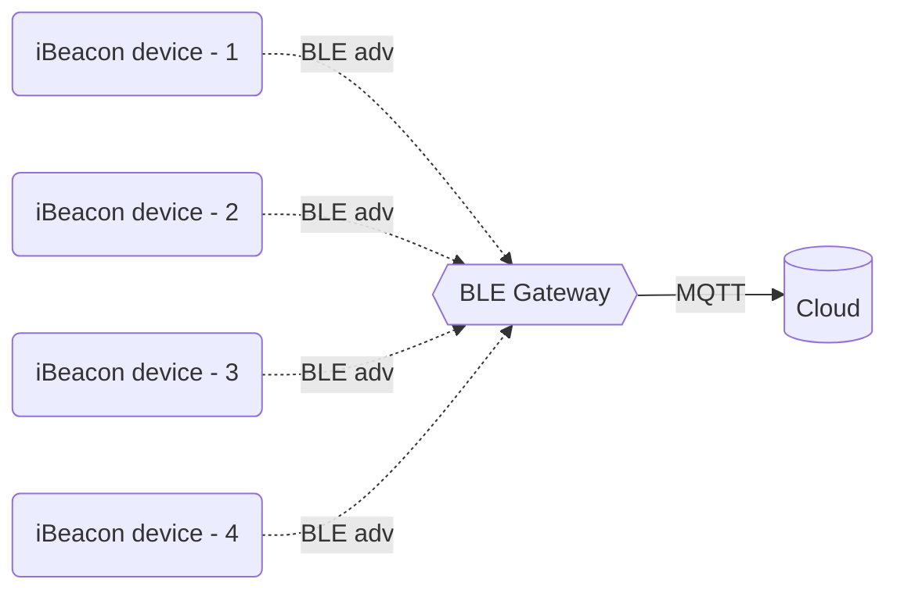

# Bluetooth iBeacon Gateway

The device scan ibeacon message of configurated devices load from Cloud.

# Structure

# How it work?

## 1 - WIFI provisioning

The smart phone access the WIFI AP and connect to HTTP server on ESP32. Then send post message with WIFI SSID and PASSWORD.

## 2 - Connect to MQTT broker

MQTT client on ESP32 connected success to broker then subcribe to special topic for get the ibeacon device to be collect data the device matched with MAC address and iBeacon UUID

## 3 - Scan iBeacon message and publish to cloud

The data storage on devices as buffer and publish to MQTT as sequency.

